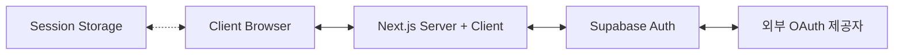

# 브릿지메이커스 웹사이트 인증 시스템 아키텍처

## 1. 전체 아키텍처 개요



## 2. 주요 구성 요소 및 역할

| 구성요소 | 역할 및 설명 |
|---------|------------|
| OAuth2 기반 외부 인증 | - Google, Apple 등 OAuth 공급자 연동<br>- 보안성 향상 및 소셜 로그인 지원 |
| Supabase Auth | - 인증 토큰 관리<br>- 사용자 세션 저장<br>- 인증 관련 API 제공 |
| Session Storage | - 프로필 정보 로컬 캐싱<br>- 불필요한 DB 조회 최소화 |
| Next.js 클라이언트 | - 세션 및 프로필 상태 관리<br>- UI 업데이트 |
| React Context | - 앱 전체 인증 상태 공유<br>- 캐시된 프로필 정보 제공 |

## 3. 최적화된 인증 흐름

1. **초기 로드**
   - 세션 스토리지에서 캐시된 프로필 확인
   - 세션이 있고 캐시가 없는 경우에만 DB 조회
   - 초기 상태 설정 및 UI 렌더링

2. **로그인 프로세스**
   - OAuth 제공자 통해 인증
   - 세션 생성 및 토큰 저장
   - 프로필 정보 조회 및 캐싱

3. **세션 유지**
   - HttpOnly 쿠키로 세션 관리
   - 캐시된 프로필 정보 활용
   - 필요한 경우에만 DB 접근

4. **상태 변경 처리**
   - 로그인: 프로필 정보 새로 조회 및 캐싱
   - 로그아웃: 세션 및 캐시 정리
   - 프로필 업데이트: DB 갱신 후 캐시 업데이트

## 4. 구체적 구현

### 4-1. AuthProvider 구현
```typescript
export function AuthProvider({ children }) {
  const [session, setSession] = useState(null);
  const [userProfile, setUserProfile] = useState(null);
  const [loading, setLoading] = useState(true);

  useEffect(() => {
    const supabase = createClient();
    
    // 1. 초기 상태 설정
    const initializeAuth = async () => {
      // 캐시된 프로필 확인
      const cachedProfile = sessionStorage.getItem('userProfile');
      if (cachedProfile) {
        setUserProfile(JSON.parse(cachedProfile));
      }

      // 세션 확인
      const { data: { session } } = await supabase.auth.getSession();
      setSession(session);

      // 필요한 경우에만 DB 조회
      if (session?.user && !cachedProfile) {
        await fetchUserProfile(session.user.id);
      }
      
      setLoading(false);
    };

    initializeAuth();
    
    // 2. 인증 상태 변경 감지
    const { subscription } = supabase.auth.onAuthStateChange(
      async (event, session) => {
        setSession(session);
        handleAuthChange(event, session);
      }
    );

    return () => subscription.unsubscribe();
  }, []);

  return (
    <AuthContext.Provider value={{ session, userProfile, loading }}>
      {children}
    </AuthContext.Provider>
  );
}
```

### 4-2. 프로필 관리 최적화
```typescript
const fetchUserProfile = async (userId) => {
  // 이미 프로필 정보가 있으면 스킵
  if (userProfile?.id === userId) return;

  const { data: profile } = await supabase
    .from('profiles')
    .select('*')
    .eq('id', userId)
    .single();

  if (profile) {
    setUserProfile(profile);
    sessionStorage.setItem('userProfile', JSON.stringify(profile));
  }
};
```

### 4-3. 보안 설정
- HttpOnly 쿠키 사용 (Supabase 기본 제공)
- CSRF 토큰 자동 처리
- SSL/TLS 통신 필수

## 5. 성능 최적화 포인트

1. **캐싱 전략**
   - 세션 스토리지 활용
   - 프로필 정보 로컬 저장
   - 불필요한 DB 조회 방지

2. **조건부 데이터 조회**
   - 캐시 우선 사용
   - 필요한 경우에만 DB 접근
   - 중복 요청 방지

3. **상태 관리 효율화**
   - 필수 상태만 유지
   - 메모리 사용 최적화
   - 불필요한 리렌더링 방지

## 6. 구현 체크리스트

### Phase 1: 기본 설정
- [x] Supabase 클라이언트 설정
- [x] AuthProvider 구현
- [x] 세션 스토리지 연동

### Phase 2: 최적화
- [x] 프로필 캐싱 구현
- [x] DB 조회 최적화
- [x] 상태 관리 개선

### Phase 3: 보안 강화
- [x] HttpOnly 쿠키 설정
- [x] CSRF 보호
- [x] SSL/TLS 적용

### Phase 4: 테스트
- [ ] 캐싱 동작 확인
- [ ] 성능 측정
- [ ] 보안 검증

## 7. 결론

- 효율적인 캐싱 전략으로 DB 부하 최소화
- 안전하고 빠른 인증 처리
- 사용자 경험 최적화
- 확장 가능한 아키텍처 설계
