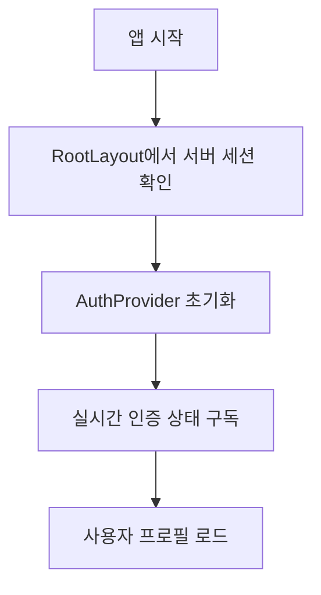

# 브릿지메이커스 웹사이트 인증 시스템 문서

## 목차
- [시스템 구조](#시스템-구조)
- [주요 컴포넌트](#주요-컴포넌트)
- [인증 프로세스](#인증-프로세스)
- [성능 최적화](#성능-최적화)
- [문제 해결](#문제-해결)

## 시스템 구조

### Supabase 클라이언트 관리
클라이언트는 Next.js App Router와 Supabase Auth Helpers를 사용하여 구현되어 있습니다.

```typescript
// lib/supabase/client.ts
import { createClientComponentClient } from '@supabase/auth-helpers-nextjs';

export const supabase = createClientComponentClient<Database>();
```

### 상태 관리
- `session`: 현재 인증 세션
- `user`: 기본 사용자 정보
- `userProfile`: 확장된 사용자 프로필 정보
- `isLoading`: 인증/프로필 로딩 상태

## 인증 프로세스

### 1. 초기화 과정



1. **앱 시작 시:**
   - `RootLayout`에서 서버 세션 확인
   - `AuthProvider`에 초기 세션 전달
   - 실시간 인증 상태 구독 설정

2. **세션 존재 시:**
   - 사용자 프로필 DB 조회
   - 프로필 정보 상태 저장
   - 실시간 업데이트 구독

### 2. 인증 방식

#### OAuth 로그인 (Google)
```typescript
const signIn = async (provider: 'google') => {
  await supabase.auth.signInWithOAuth({
    provider,
    options: {
      redirectTo: `${window.location.origin}/auth/callback`,
    },
  });
};
```

#### 이메일/비밀번호 로그인
```typescript
const signInWithEmail = async (email: string, password: string) => {
  await supabase.auth.signInWithPassword({
    email,
    password,
  });
};
```

#### 회원가입
```typescript
const signUpWithEmail = async (email: string, password: string, firstName: string, lastName: string) => {
  await supabase.auth.signUp({
    email,
    password,
    options: {
      data: {
        first_name: firstName,
        last_name: lastName,
      },
      emailRedirectTo: `${window.location.origin}/auth/callback`,
    },
  });
};
```

### 3. 프로필 관리

#### 프로필 조회 로직
```typescript
const loadUserProfile = async () => {
  if (!user) {
    setUserProfile(null);
    return;
  }

  const { data, error } = await supabase
    .from('users')
    .select('*')
    .eq('id', user.id)
    .single();

  if (error) {
    await createUserProfile(user);
  } else {
    setUserProfile(data);
  }
};
```

#### 프로필 생성 로직
```typescript
const createUserProfile = async (user: User) => {
  const { data } = await supabase
    .from('users')
    .insert([
      {
        id: user.id,
        email: user.email,
        first_name: user.user_metadata?.first_name,
        last_name: user.user_metadata?.last_name,
        profile_image_url: user.user_metadata?.avatar_url,
        user_level: UserRole.BASIC,
      },
    ])
    .select()
    .single();

  setUserProfile(data);
};
```

## 성능 최적화

### 1. 서버 사이드 렌더링
- `RootLayout`에서 초기 세션 확인
- 서버 컴포넌트에서 데이터 프리페치
- 클라이언트 하이드레이션 최적화

### 2. 실시간 업데이트
- Supabase 실시간 구독으로 즉시 상태 반영
- Context API를 통한 효율적인 상태 공유
- 불필요한 리렌더링 방지

### 3. 에러 처리
- 세부적인 에러 메시지 처리
- 사용자 친화적인 에러 표시
- 자동 복구 메커니즘

## 문제 해결

### 일반적인 문제들

1. **인증 상태 불일치**
   - 브라우저 데이터 초기화 기능 제공
   - 자동 세션 갱신
   - 페이지 새로고침으로 상태 동기화

2. **리다이렉션 문제**
   - `/auth/callback` 페이지에서 적절한 처리
   - 에러 발생 시 전용 에러 페이지로 이동
   - 인증 완료 시 원래 페이지로 복귀

3. **프로필 동기화**
   - 실시간 구독으로 즉시 반영
   - 프로필 없을 시 자동 생성
   - 상태 변경 시 UI 즉시 업데이트

### 디버깅 팁

콘솔 로그 패턴:
- 🚀 초기화 관련
- 🔄 상태 변화
- ✅ 성공
- ❌ 에러
- ⚠️ 경고
- 📡 네트워크 요청
- 🔍 데이터 확인

### 보안 고려사항

1. **토큰 관리**
   - httpOnly 쿠키 사용
   - 자동 토큰 갱신
   - 안전한 저장소 활용

2. **권한 검사**
   - 서버 사이드 검증 필수
   - 역할 기반 접근 제어
   - 미들웨어에서 라우트 보호

# 인증 시스템 설계

## 기본 원칙

1. **서버/클라이언트 컴포넌트 분리**
   - 서버 컴포넌트: 초기 데이터 로딩, SEO 관련 작업
   - 클라이언트 컴포넌트: 상호작용, 실시간 상태 관리

2. **데이터 페칭 전략**
   - 초기 데이터: 서버 사이드에서 처리
   - 실시간 업데이트: 클라이언트 사이드에서 처리
   - 사용자 액션: Server Actions 사용

## 컴포넌트 구조

```
app/
  ├── components/
  │   └── auth/
  │       ├── AuthProvider.tsx (서버 컴포넌트)
  │       ├── ClientAuthProvider.tsx (클라이언트 컴포넌트)
  │       └── AuthButtons.tsx (클라이언트 컴포넌트)
  └── lib/
      └── auth/
          ├── actions.ts (서버 액션)
          └── client.ts (클라이언트 유틸리티)
```

## 컴포넌트별 책임

### AuthProvider (서버 컴포넌트)
```typescript
async function AuthProvider({ children }) {
  // 1. 서버에서 초기 세션 확인
  // 2. 초기 사용자 데이터 프리페치
  // 3. ClientAuthProvider에 초기 데이터 전달
}
```

### ClientAuthProvider (클라이언트 컴포넌트)
```typescript
export function ClientAuthProvider({ 
  initialSession, 
  initialProfile, 
  children 
}) {
  // 1. 초기 데이터로 상태 초기화
  // 2. 실시간 세션 업데이트 처리
  // 3. Context를 통한 상태 공유
}
```

## 데이터 흐름

1. **초기 로드**
   - 서버에서 세션 확인
   - 필요한 사용자 데이터 프리페치
   - 클라이언트에 초기 상태 전달

2. **실시간 업데이트**
   - Supabase 실시간 구독 설정
   - 세션/프로필 변경 시 상태 업데이트
   - Context를 통해 하위 컴포넌트에 전파

3. **사용자 액션**
   - Server Actions를 통한 데이터 수정
   - 낙관적 업데이트 적용
   - 실시간 동기화로 최종 상태 반영

## 성능 최적화

1. **서버 사이드 렌더링**
   - 초기 HTML에 데이터 포함
   - 클라이언트 번들 크기 최소화
   - SEO 최적화

2. **캐싱 전략**
   - 서버 컴포넌트 캐싱
   - 정적 데이터 재사용
   - 동적 데이터 실시간 업데이트

## 에러 처리

1. **서버 사이드**
   - 세션 만료/인증 실패 처리
   - 데이터베이스 오류 처리
   - 적절한 에러 페이지 표시

2. **클라이언트 사이드**
   - 네트워크 오류 처리
   - 실시간 연결 재시도
   - 사용자 피드백 제공

## 보안 고려사항

1. **인증 토큰**
   - 안전한 저장 및 갱신
   - CSRF 보호
   - XSS 방지

2. **권한 검사**
   - 서버 사이드 검증
   - 클라이언트 사이드 UI 조정
   - 역할 기반 접근 제어

## 테스트 전략

1. **단위 테스트**
   - 컴포넌트별 독립 테스트
   - 인증 로직 검증
   - 에러 처리 확인

2. **통합 테스트**
   - 전체 인증 플로우 검증
   - 실제 API 호출 테스트
   - 성능 메트릭 측정 

# 인증 시스템 문제 해결 가이드

## 구조

현재 인증 시스템은 Supabase Auth Helpers for Next.js를 사용하여 구현되어 있습니다:

1. **서버 컴포넌트**: `createServerClient`를 사용하여 서버 측 인증 확인
2. **클라이언트 컴포넌트**: `createClientComponentClient`를 사용하여 클라이언트 측 인증 처리
3. **미들웨어**: `createMiddlewareClient`를 사용하여 세션 관리 및 라우팅 보호

## 알려진 문제

### 1. 쿠키 파싱 오류

```
Failed to parse cookie string: SyntaxError: Unexpected token 'b', "base64-eyJ"... is not valid JSON
```

이 오류는 브라우저에 저장된 Supabase 인증 쿠키가 손상되었을 때 발생합니다.

**해결 방법**:
- 브라우저 쿠키를 초기화합니다 (앱에서 '데이터 초기화' 버튼 사용)
- 시크릿 모드로 접속해봅니다
- 다른 브라우저로 접속해봅니다

### 2. API 경로에서 Supabase 클라이언트 생성 오류

```
Attempted import error: 'createClient' is not exported from '@/lib/supabase/server'
```

**해결 방법**:
- `createClient` 대신 `createServerClient`를 사용합니다
- API 라우트에서는 `cookies()` API 사용 방법에 주의합니다

## 개발 환경에서 테스트하기

1. 쿠키 문제가 발생하면:
   ```bash
   # Next.js 캐시 삭제
   rm -rf .next
   
   # 개발 서버 재시작
   npm run dev
   ```

2. 브라우저에서:
   - 개발자 도구를 열고 Application 탭으로 이동
   - Cookies > localhost를 선택
   - `supabase` 관련 쿠키를 모두 삭제
   - 페이지 새로고침

## 서버/클라이언트 경계 준수

인증 관련 코드 작성 시 다음 규칙을 따릅니다:

1. **서버 컴포넌트에서**:
   - `createServerClient()`를 사용하여 Supabase 클라이언트 생성
   - 초기 세션 데이터 로드
   - 이 클라이언트는 쿠키를 읽을 수만 있음

2. **클라이언트 컴포넌트에서**:
   - 반드시 `'use client'` 지시문 사용
   - `createClientComponentClient()`를 사용하여 Supabase 클라이언트 생성
   - 이 클라이언트는 쿠키를 읽고 쓸 수 있음
   - 로그인/로그아웃 등 인증 상태 변경 작업 수행

3. **미들웨어에서**:
   - `createMiddlewareClient()`를 사용하여 Supabase 클라이언트 생성
   - 세션 새로고침 및 라우팅 보호

## 기타 문제 해결

문제가 지속되면 다음을 시도해 보세요:

1. 패키지 업데이트:
   ```bash
   npm update @supabase/auth-helpers-nextjs @supabase/supabase-js
   ```

2. 쿠키 관련 미들웨어 수정:
   - `middleware.ts` 파일에서 쿠키 처리 방식 변경
   - 더 강력한 오류 처리 추가

3. 개발 환경 초기화:
   ```bash
   rm -rf node_modules .next
   npm install
   npm run dev
   ``` 